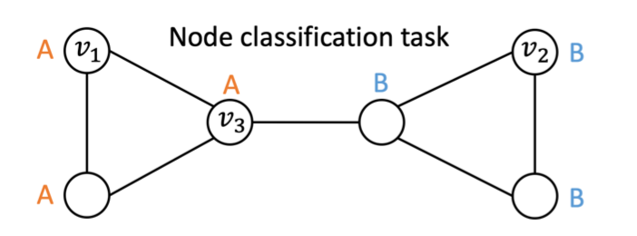
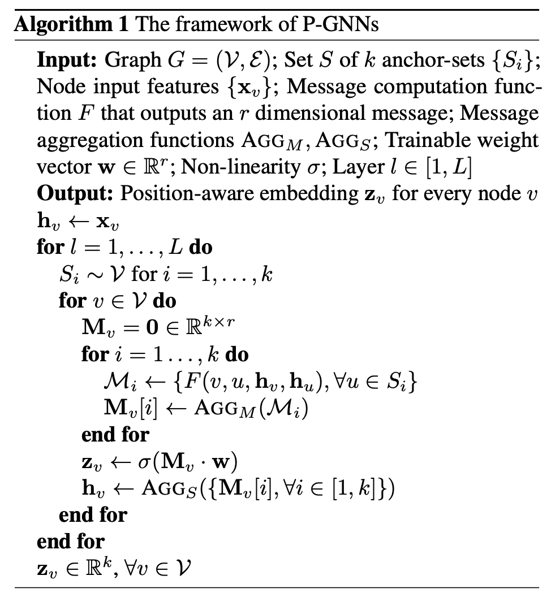
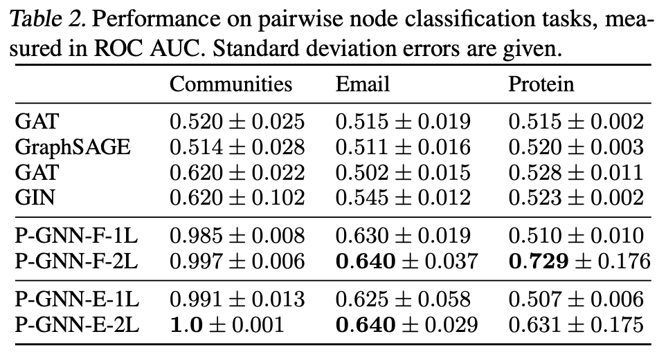
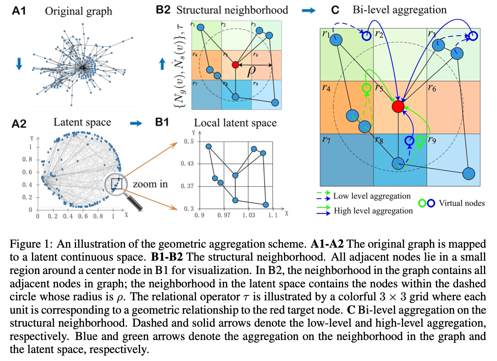
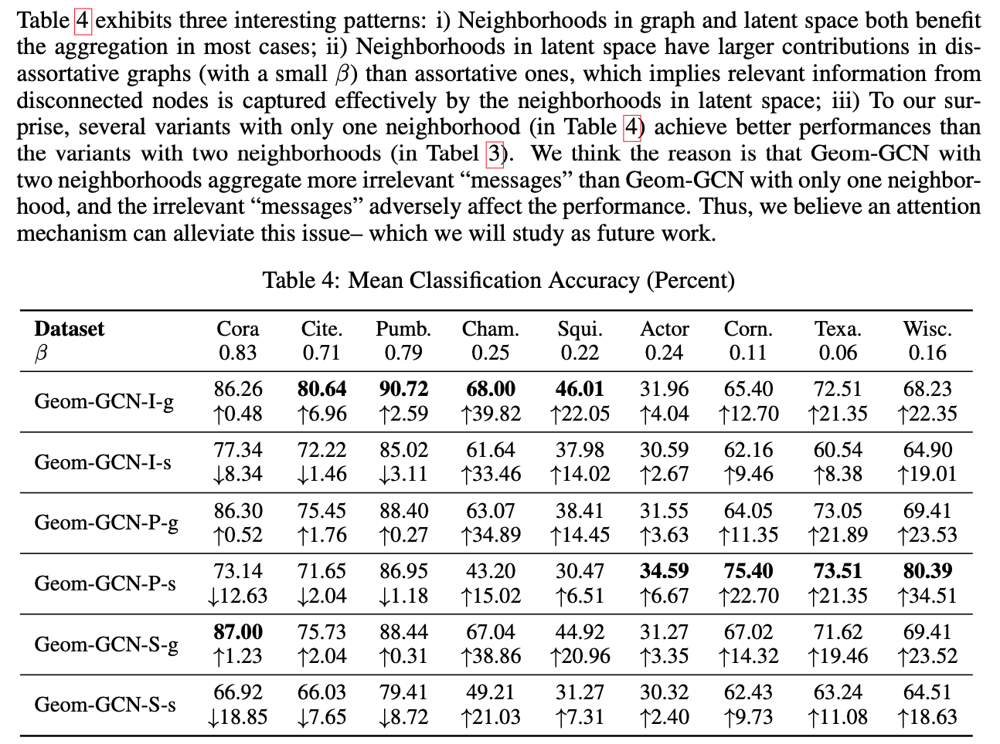
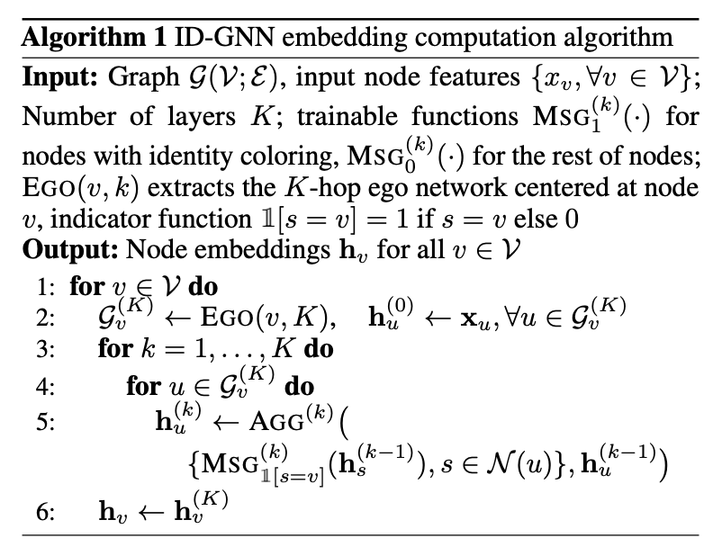
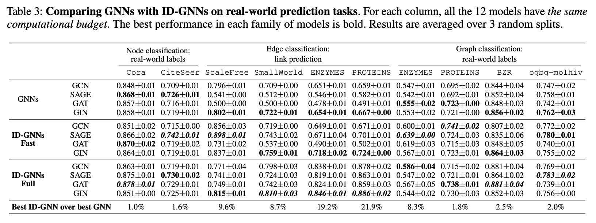
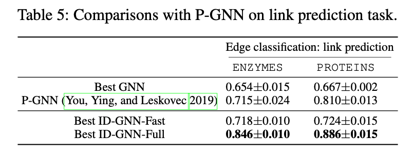
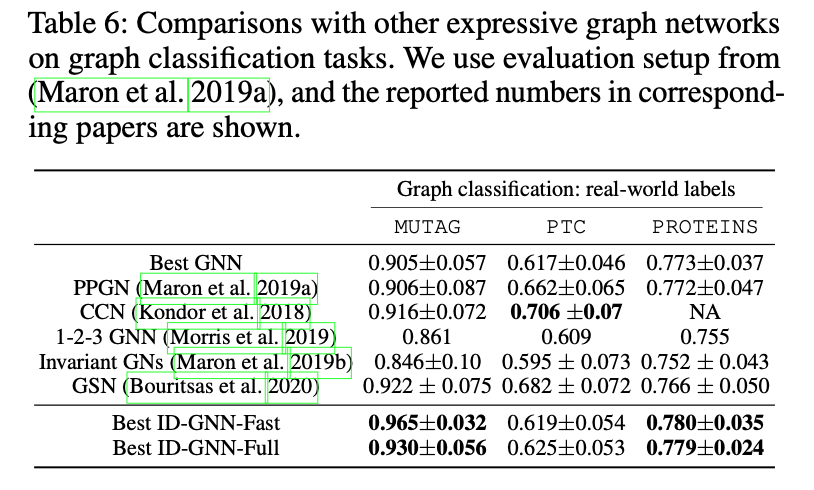

# 更强表达力的GNNs：P-GNNs、DEOM-GCN、ID-GNN

根据(Xu et al., 2019)基于图消息传递架构的GNN的表达能力上限是1-WL图同构测试（1-Weisfeiler-Lehman graph isomorphism test），也就是说，在只使用图结构信息的情况下，这些GNNs不能区分开处于同构位置的两个节点。举个例子，如下图中的节点$v_1$和$v_2$有相同的局部邻居结构，GNN会把它们映射到Embedding空间中相同的点上。

下面的三篇文章从不同的角度出发来增强GNN的表达能力。

## 1.P-GNNs：Position-aware Graph Neural Networks

## Position-aware V.S. Structure-aware

**Position-aware**: 如果图节点的Embedding可以保留两个节点在图上的最短路径的信息，我们称这种图节点的Embedding是Position-aware的。

**Structure-aware**：如果图节点的Embedding是该节点的q阶邻居的函数，那么这种图节点的Embedding是Structure-aware的。

大部分的基于图上的信息传递范式的GNN都是structure aware的，如GCN、GraphSage、GAT等。

作者证明了：**仅当图中不存在具有同构q阶邻居的节点对的时候，才存在从structure-aware到position-aware的映射函数。**

这其实就是在说，不对GNN进行本质上的改造，是不可能学到position-aware的embeddings的。

### P-GNNs

作者利用Bourgain Theorem，借助锚点集合的方式，可以从理论上保证空间的弯曲度（distortion）在一定的程度内。从使用锚点集合来作为图上的相对位置的基点，在计算节点的Embedding时融合距离信息，从而学习到带有位置信息的Embedding。

P-GNNs的整体流程如下：

（1）从图上选择k个锚点集合；

（2）计算点关于锚点集合中的点的消息，消息计算函数融合了两个点之间的距离；

（3）聚合点关于锚点集合中的点的消息；

（4）聚合点的所有锚点集合的消息。

P-GNNs的伪代码如下：

几个关键点：

**锚点集合的采样方法**：$S_{ij} \subset V, i=1,\cdots,\log n,j=1,\cdots,c\log n$。抽样$S_{ij}$时，从$V$中对每个节点独立采样，概率为$\frac{1}{2^i}$。

**基于距离的消息函数**：

$F(v,u,h_v,h_u)=s(v,u)\text{CONCAT}(h_v,h_u)$

其中，$s(v,u)=\frac{1}{d_{sp}^q(v,u)+1}$，两个节点之间的q阶最短路径距离$d_{sp}^q(v, u)= \begin{cases} d_{sp}(v,u),  & \text{if } d_{sp}(v,u) \le q, \\ \infty, & \text{otherwise} \end{cases}$。

### 实验结果

## 2.GEOM-GCN: GEOMETRIC GRAPH CONVOLUTIONAL NETWORKS

作者观察到基于消息传递的GNN存在丢失结构信息和缺乏在不确定性图上学习远程依赖的能力。提出了几何聚合模式来克服这两个缺点。

确定性图：图中的相似节点更可能互相接近，相近的接节点更可能相似。如论文引用网络。

不确定性图：相似的节点在结构上高度相似，但互相距离很远。

如下图左图所示，如果每个节点的都有相同的feature，消息传递GNN区分不开两个处于不同结构里的节点$V_1$：

GEOM-GCN构造了隐空间，在隐空间中构建了节点间的近邻关系，同时聚合隐空间的近邻关系和原图上的近邻关系信息。GEOM-GCN利用了节点在隐空间里的相对位置关系，可以区分这两个节点（如右图所示）。

### GEOM-GCN

整体流程如下：

（1）用于构造隐空间（latent space）的节点Embedding表示，把节点映射到latent space里：如Isomap、Poincare embedding、struc2vec等可以保留图上的拓扑模式的方法，得到节点在隐空间的表示。

（2）利用隐空间里的距离构造近邻关系，记为s。论文中使用的是欧式距离。

（3）再加上图结构的近邻关系g，有两个近邻关系(g,s)

（4）Bi-level聚合：在两个近邻关系里分别聚合，聚合到虚拟节点上，然后再把虚拟节点上的信息做聚合得到节点的Embedding表示。

Bi-level聚合的细节：

把两个近邻关系聚合到虚拟节点上：节点$v$在第$l+1$层输出的虚拟节点为

$e_{i,r}^{v,l+1}=\sum_{u\in N_i(v)} \delta(\tau(z_v,z_u),r)(deg(v)deg(u))^{1/2} h_u^l, i \in {g,s}, r\in R$

其中，$deg(v)$表示节点$v$在图中的度，$\delta(.,.)$是示性函数：第一个参数与第二个参数相等时为1，否则为0；函数$\tau$是几何操作函数，用于描述两个节点的相对位置，是保留几何空间里位置关系的关键：

$r$表示两个节点的相对位置关系，取值空间是{upper left, upper right, lower left, lower right}。

### 主要实验结果

另外，作者使用邻居节点的label的相同比例来度量同质性（下表中的$\beta$），发现在同质性较低的网络上，GEOM-GCN的提升效果更明显。

## 3. ID-GNN: Identity-aware Graph Neural Networks

作者发现基于消息传递的GNN表达力的上界是1-WL图同构测试，不能预测节点的聚类系数、最短路径距离，无法区分不同的d-regular graphs（图中的各个节点的度都是d）。作者提出了ID-GNN，表达力可以超越1-WL图同构测试。在计算节点的embeding时，抽取节点的自我中心网络，在计算消息函数时使用异构的消息函数，中心节点和周围节点使用不同的消息函数。

### ID-GNN

ID-GNN的整体流程如下：

（1）对于要计算embedding的节点$v$，抽取以它为中心的K-阶自我中心网络；

（2）对于K-阶自我中心网络中的节点$u$，利用其邻居节点进行消息聚合计算，在聚合中心节点$v$时，使用不同的消息函数；

（3）重复（2）步骤K次；

（4）得到中心节点$v$的Embedding。

ID-GNN的核心点就是计算节点的Embedding时，针对中心节点和周围节点使用不同的消息函数。

**ID-GNN-Fast**

mini-batch版本的实现在抽取自我中心网络时有很大的开销，而cycle count信息是ID-GNN比GNN表达力更强的一个重要方面，作者提出了Fast版本的ID-GNN，把节点的cycle count信息加入到节点特征中，然后使用GNN算法进行计算：节点$v$的特征增加K维$x_v^+\in R^K$，$x_v^+[v] = \text{Diag}(A^k)[v]$，然后拼接到原始特征上$x_v = \text{CONCAT}(x_v, x_v^+)$。

### 主要实验结果

作者在模拟数据集和真实数据集上与GNN做了对比实验。

与其他比常见GNN表达力更强的算法的对比，如上文中的P-GNN。

## 参考资料

[1] Xu, K., Hu, W., Leskovec, J., and Jegelka, S. How powerful are graph neural networks? *International Conference on Learning Representations*, 2019. 

[2] You, J.; Ying, R.; and Leskovec, J. Position-aware graph neural networks. *International Conference on Machine Learning (ICML) ,* 2019.  [3] Pei, H., Wei, B., Chang, K. C.-C., Lei, Y., and Yang, B. Geom-gcn: Geometric graph convolutional networks. In ICLR, 2020.

[4] Jiaxuan You, Jonathan Gomes-Selman, Rex Ying, and Jure Leskovec. IdentityAware Graph Neural Networks. In AAAI, 2021. 
